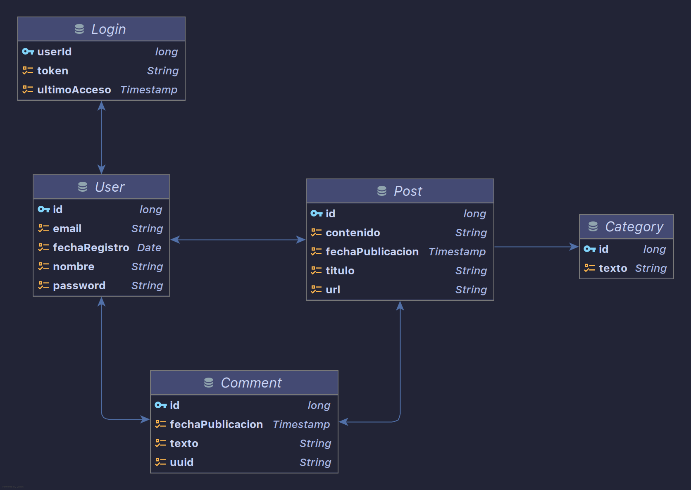

# Blog-Hibernate-ObjectDB-AccesoDatos-2021-2022
Ejemplo de desarrollo de un blog (backend básico) para Acceso a Datos, usando una base de datos orientada a objetos ObjectDB usando JPA e implementando distintas técnicas y patrones de Acceso a Datos vistos en clase.

[](https://www.java.com/es/)
[]()


- [Blog-Hibernate-ObjectDB-AccesoDatos-2021-2022](#blog-hibernate-objectdb-accesodatos-2021-2022)
  - [Descripción](#descripción)
  - [Tecnologías](#tecnologías)
  - [Enunciado](#enunciado)
    - [Ejemplo de diagrama](#ejemplo-de-diagrama)
  - [Desarrollo](#desarrollo)
    - [GitFlow](#gitflow)
    - [Arquitectura](#arquitectura)
  - [JPA: Java Persistence API](#jpa-java-persistence-api)
  - [ObjectDB](#objectdb)
  - [Diagrama de la Persistencia](#diagrama-de-la-persistencia)
  - [Ejecución](#ejecución)
    - [Tools](#tools)
  - [Autor](#autor)
    - [Contacto](#contacto)
  - [Licencia](#licencia)

## Descripción
Se ha implementado el desarrollo del un blog a nivel de backend para el acceso a los datos que se necesiten con fines didácticos para el módulo de Acceso a Datos de 2DAM.
Debes entender que es un ejemplo didáctico para clase, por lo que parte de la solución simplemente es para mostrar distintas técnicas y patrones y por lo tanto 
puede que no sea la más óptima o adecuada a niveles de producción o empresarial. Tenlo en cuenta.

Este ejemplo, su arquitectura y parte de su solución proviene del anterior ejemplo visto en clase y que puedes encontrar [aquí](https://github.com/joseluisgs/Blog-Relacional-AccesoDatos-2021-2022). La versión relacional usando Hibernate y JPA la tienes en [este enlace](https://github.com/joseluisgs/Blog-Hibernate-ORM-AccesoDatos-2021-2022) disponible.

A lo largo de este desarrollo actualizaremos el ejemplo anterior para trabajar con tecnología orientada a objetos y con ella usar Hibernate y JPA para realizar el Mapeo Objeto-Documentos con nuestra base de datos NoSQL con MongoDB.

## Tecnologías
Se han usado las siguientes tecnologías:
- Java 11, como lenguaje de programación.
- ObjectDB como base de datos orientada a objetos.
- Docker para lanzar la base de datos, así como otras utilidades para manejarla.
- Hibernate como OGM
- JPA: Java Persistence API

## Enunciado
Se desea implementar la base de un blog teniendo en cuenta que: 
- Un usuario una vez registrado mediante email y password puede hacer login y logout en el sistema.
- El usuario puede escribir varios posts los cuales pertenecen solo a una categoría existente, como general, dudas o evaluación. Se pueden crear nuevas categorías.
- Los usuarios pueden hacer distintos comentarios sobre posts existentes.

### Ejemplo de diagrama


## Desarrollo
### GitFlow
Se ha usado GitFlow como modelo de flujo de desarrollo y trabajo con el repositorio.

### Arquitectura
Puedes leer sobre ella [aquí](https://github.com/joseluisgs/Blog-Relacional-AccesoDatos-2021-2022#arquitectura). 

## JPA: Java Persistence API
Java Persistence API, más conocida por sus siglas JPA, es la API de persistencia desarrollada para la plataforma Java EE.
JPA es una especificación y no un Framework como tal, por lo tanto necesita de alguien que lo implemente, por ejemplo Hibernate.

## ObjectDB
ObjectDB es una base de datos orientada a objetos para Java. Se puede utilizar en modo cliente-servidor y en modo incrustado (en proceso).A diferencia de otras bases de datos orientadas a objetos, ObjectDB no proporciona su propia API propietaria. Por lo tanto, el trabajo con ObjectDB requiere el uso de una de las dos API estándar de Java - JPA o JDO. Ambas APIs están incorporadas en ObjectDB, por lo que no es necesario un software ORM intermedio como Hibernate.

## Diagrama de la Persistencia 
El diagrama de la persistencia generada puede verse en esta imagen.
;

## Ejecución
### Tools
Para explorar la base de datos, puedes usar Explorer de la carpeta Tools
```bash
java -jar explorer.jar
```

## Autor

Codificado con :sparkling_heart: por [José Luis González Sánchez](https://twitter.com/joseluisgonsan)

[](https://twitter.com/joseluisgonsan)
[](https://github.com/joseluisgs)

### Contacto
<p>
  Cualquier cosa que necesites házmelo saber por si puedo ayudarte 💬.
</p>
<p>
    <a href="https://twitter.com/joseluisgonsan" target="_blank">
        
    </a> &nbsp;&nbsp;
    <a href="https://github.com/joseluisgs" target="_blank">
        
    </a> &nbsp;&nbsp;
    <a href="https://www.linkedin.com/in/joseluisgonsan" target="_blank">
        
    </a>  &nbsp;&nbsp;
    <a href="https://joseluisgs.github.io/" target="_blank">
        
    </a>
</p>


## Licencia

Este proyecto está licenciado bajo licencia **MIT**, si desea saber más, visite el fichero [LICENSE](./LICENSE) para su uso docente y educativo.
